# OBJECT

**A cycling computer for people who enjoy building things as much as riding them.**

OBJECT puts your speed, distance and ride stats on a 3.2″ display, records a GPS track to a microSD card, and lets you download it to your phone over Bluetooth. It is built around a **Seeed XIAO nRF52840 Sense**, a wheel magnet and reed switch, and a handful of readily available modules.

<p align="center">
  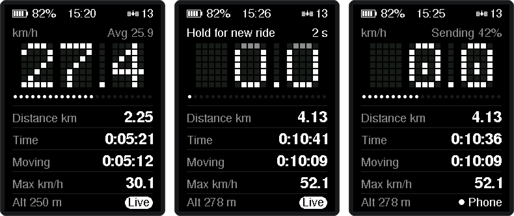
</p>
<p align="center"><sub>Riding and recording · holding the button for a new ride · sending a track to the phone</sub></p>

The aim is simple: readable numbers on the handlebars, one button, and a record of where you went. This is a working DIY project still being refined.

## Out on the bike

- **Speed and distance from the wheel.** A reed switch counts one pulse per revolution. Wheel speed works independently of GPS reception. Circumference and other ride settings come from `CONFIG.TXT` on the card.
- **The essentials at a glance.** Current speed, distance, elapsed time, estimated moving time, maximum speed and average speed.
- **A track to take home.** The GPS supplies position, altitude and UTC time for GPX recording on the microSD card.
- **One button.** A short press changes the backlight; a four-second hold while stopped finishes the current ride and starts a fresh one.
- **Battery level.** The top left shows a five-bar icon and a percentage, read from the LiPo through a divider on the button pin. Readings run high while charging.
- **Phone downloads.** Connect to `OBJECT-001` through the [ride-transfer page](https://object.nav-tech.workers.dev), confirm on the device within 10 seconds, and download a GPX file, including a snapshot of the current track.
- **Trip recovery.** Saved counters are restored after a restart when a valid checkpoint is available.

The trip starts with the first wheel pulse. GPS recording begins when the firmware has the required fix, position and time data. You can ride without a GPS fix, but those wheel stats are not currently archived as a separate ride summary.

## Reading the screen

<p align="center">
  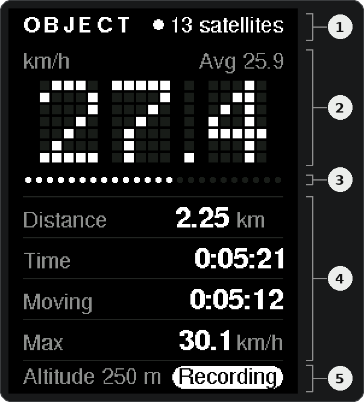
</p>

The portrait layout keeps current speed largest, with supporting information underneath:

1. **Status bar:** battery level on the left; a satellite icon with the satellite count, or “Searching” until there is a fix, on the right.
2. **Dot-matrix speed:** km/h or mph (from `units`). The line above it shows the unit and **Avg**; it also carries prompts such as “Hold for new ride” and “Press to allow”.
3. **24-dot gauge:** normally speed, at 2 km/h per dot, so it is full from about 47 km/h. It also shows hold-to-save, phone-confirm and download progress.
4. **Ride stats:** Distance, Time, Moving and Max. The distance and speed units sit in the labels and follow `units`. Distance switches to one decimal from 100.
5. **Footer:** altitude as **Alt** (m or ft, `--` without a fix) and a status such as `Recording`, `Phone` or `No card`.

**Time** is elapsed time since the trip began, including stops while powered on. Time spent powered off is not added after recovery. **Moving** is estimated from wheel pulses using `stopped_ms` (default three seconds); **Avg** divides wheel distance by that estimated moving time.

### Battery

The top left shows a five-bar battery icon and the charge as a percentage. The percentage is interpolated from the LiPo voltage using this table:

| Voltage | 4.20 V | 4.00 V | 3.85 V | 3.75 V | 3.65 V | 3.50 V | 3.30 V |
| --- | --- | --- | --- | --- | --- | --- | --- |
| Percent | 100 | 80 | 60 | 40 | 20 | 5 | 0 |

- The reading is smoothed, so it changes slowly.
- The battery is only measured while the button is released, so the value holds still while you press the button.
- Nothing shows until the first reading, about 50 ms after boot.
- While charging, the reading runs high.

### GPS status

| Top right | Meaning |
| --- | --- |
| 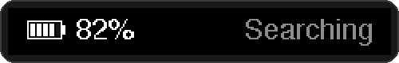 | No usable fix yet, or the GPS has gone quiet for 2 seconds. Wheel stats keep working; nothing is recorded. |
| 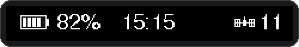 | Live fix, with the number of satellites in use. |
| 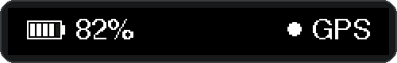 | Live fix from a receiver that does not report a satellite count. |

### Footer status

Only one status shows at a time, in this order of priority:

| Bottom right | Meaning |
| --- | --- |
|  | No microSD card, or the card stopped responding. Stats live in memory only. |
|  | A phone is connected and allowed. Recording carries on in the background. |
|  | The ride has started and the GPS has position and time, so points are going into `CURRENT.GPX`. |
|  | Nothing to report: no wheel pulse yet, or no fix. |

## Animations

The speed matrix and the gauge come alive when the bike stands still or when something happens. While the wheel turns, the speed always stays readable: the only effects then are a faint heartbeat and short sweeps along the gauge.

<table>
<tr>
<td align="center" valign="top" width="50%"><br><sub><b>Self-test</b><br>at power-on a band of light sweeps every dot once</sub></td>
<td align="center" valign="top" width="50%">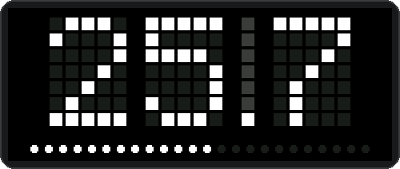<br><sub><b>Heartbeat</b><br>the cells above the decimal point glow on each wheel turn</sub></td>
</tr>
<tr>
<td align="center" valign="top">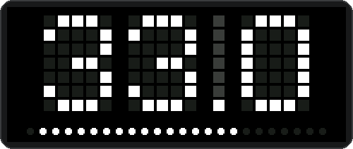<br><sub><b>New max</b><br>beat your top speed by 0.5 km/h after two minutes moving, and a comet runs the gauge (at most once a minute)</sub></td>
<td align="center" valign="top">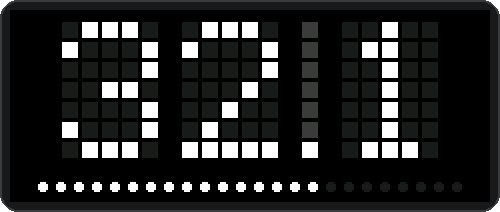<br><sub><b>Every 10 km</b><br>or 10 mi, the gauge fills and fades as you pass it…</sub></td>
</tr>
<tr>
<td align="center" valign="top">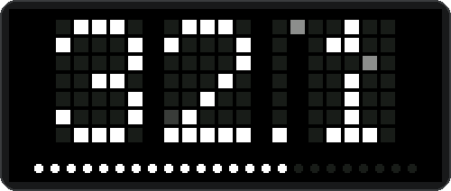<br><sub><b>…and at the next stop</b><br>the distance pops up between sparkles</sub></td>
<td align="center" valign="top">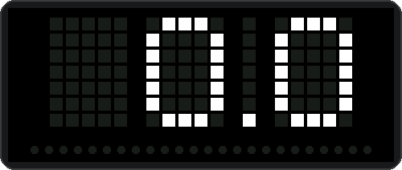<br><sub><b>Stopped for 8 s</b><br>mid-ride, the 0.0 opens its eyes</sub></td>
</tr>
<tr>
<td align="center" valign="top">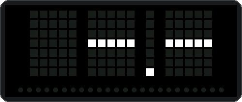<br><sub><b>Waiting</b><br>it looks around and blinks</sub></td>
<td align="center" valign="top">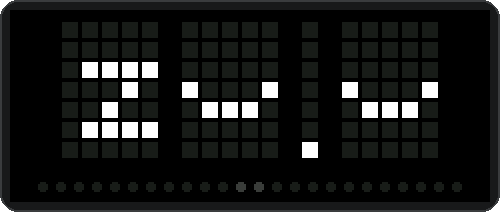<br><sub><b>After 2 minutes</b><br>it dozes off. Any wheel turn brings the speed straight back</sub></td>
</tr>
<tr>
<td align="center" valign="top">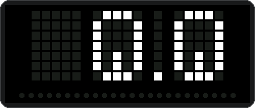<br><sub><b>Hold for new ride</b><br>the digits drain as the gauge fills</sub></td>
<td align="center" valign="top">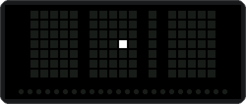<br><sub><b>Ride saved</b><br>a firework, then the fresh 0.0 drops in (also on Stats reset)</sub></td>
</tr>
<tr>
<td align="center" valign="top">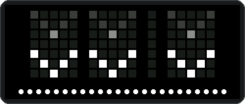<br><sub><b>Press to allow</b><br>arrows point down to the button</sub></td>
<td align="center" valign="top">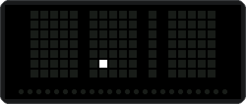<br><sub><b>Phone allowed</b><br>the Bluetooth mark draws itself, then fades</sub></td>
</tr>
</table>

Animations pause while the backlight is off. To turn them off, set `animations=off` in `CONFIG.TXT` or use the **Animations** switch in the hub's [Settings](#change-settings-from-your-phone); the matrix then only ever shows the speed.

## Turning it on

The splash shows while the card is checked, then for one second with the result:

<table>
<tr>
<td align="center" valign="top"><br><sub><b>Checking card</b><br>while the card is read</sub></td>
<td align="center" valign="top">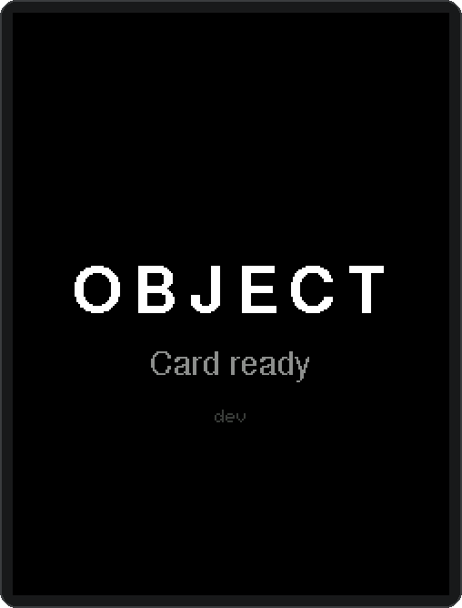<br><sub><b>Card ready</b><br>no saved ride, starting fresh</sub></td>
<td align="center" valign="top">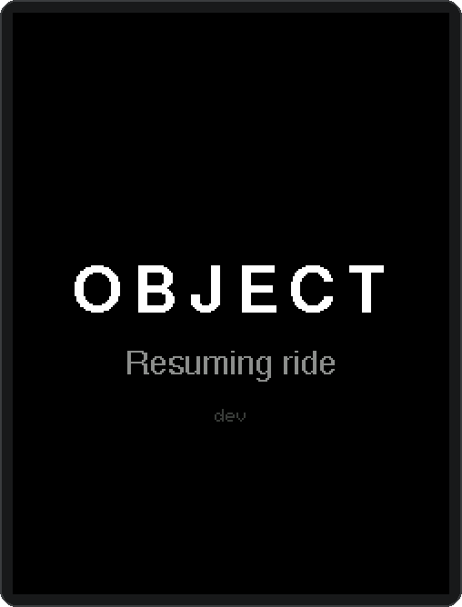<br><sub><b>Resuming ride</b><br>a valid <code>TRIP.DAT</code> was found</sub></td>
<td align="center" valign="top">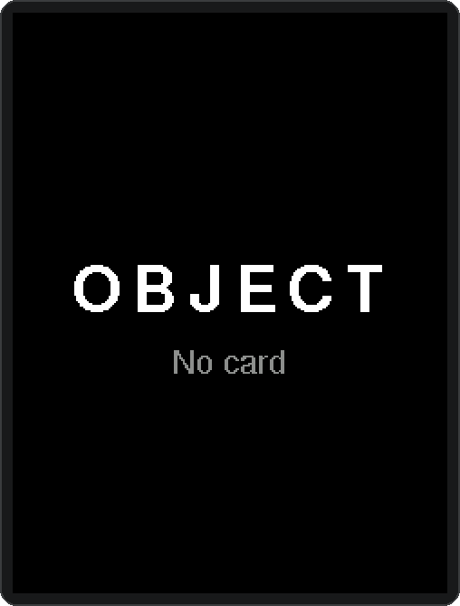<br><sub><b>No card</b><br>riding without a log</sub></td>
</tr>
</table>

After a restart the saved counters come back and Time continues from where it stopped. The trip itself starts with the first wheel pulse.

## Controls

| Action                                | Result                                                                        |
| ------------------------------------- | ----------------------------------------------------------------------------- |
| Press and release before 2 seconds    | Cycle backlight: **bright → dim → off** (or allow a pending phone connection) |
| Hold for 4 seconds while stopped      | Archive the GPS track if it has points, reset counters and start a fresh ride |
| Release during the new-ride countdown | Cancel the action; leave the backlight unchanged                              |

### Backlight

<table>
<tr>
<td align="center" valign="top"><br><sub><b>Bright</b><br>full backlight</sub></td>
<td align="center" valign="top">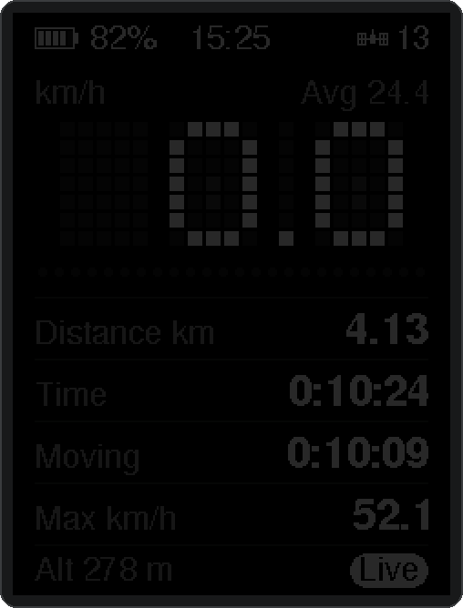<br><sub><b>Dim</b><br><code>backlight_dim</code>, default 40 of 255</sub></td>
<td align="center" valign="top"><br><sub><b>Off</b><br>still running and recording</sub></td>
</tr>
</table>

Turning the backlight off does **not** stop recording or turn off the device. The level at power-on comes from `backlight` in `CONFIG.TXT`.

### Starting a new ride

Stop and wait for the speed reading to reach zero, then hold the button. The countdown appears after two seconds; over the last two the gauge fills and the digits drain away:

<table>
<tr>
<td align="center" valign="top">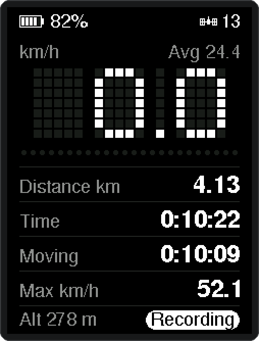<br><sub><b>Stopped</b><br>speed reads 0.0</sub></td>
<td align="center" valign="top">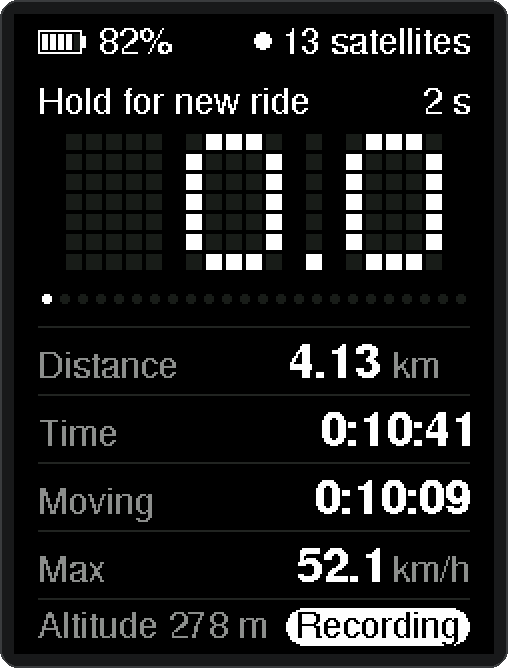<br><sub><b>Held 2 s</b><br>countdown starts</sub></td>
<td align="center" valign="top">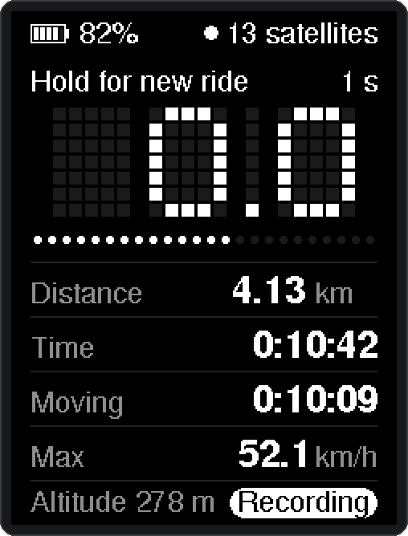<br><sub><b>Held 3 s</b><br>release now to cancel</sub></td>
<td align="center" valign="top">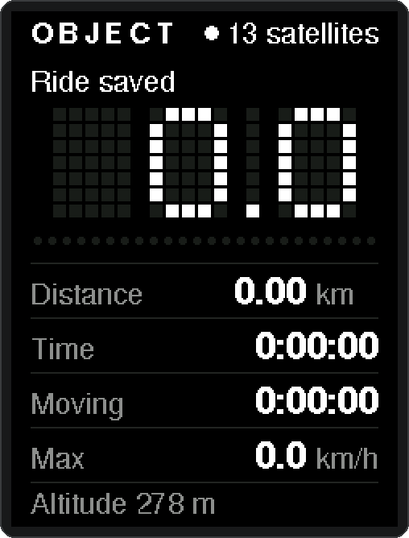<br><sub><b>Held 4 s</b><br>track archived</sub></td>
<td align="center" valign="top">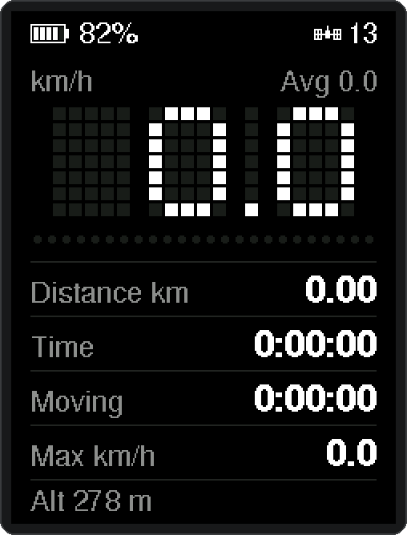<br><sub><b>New ride</b><br>waiting for the wheel</sub></td>
</tr>
</table>

The track in `CURRENT.GPX` is renamed to a dated archive such as `26100115.GPX`, and the counters reset. **If the ride has no GPS points, the current firmware clears its counters without creating an archive**, and still shows “Ride saved”. OBJECT counts as stopped once no wheel pulse has arrived for `stopped_ms` (three seconds by default). If the wheel is turning when you press, or starts turning before the four seconds are up, the hold does nothing.

<table>
<tr>
<td align="center" valign="top">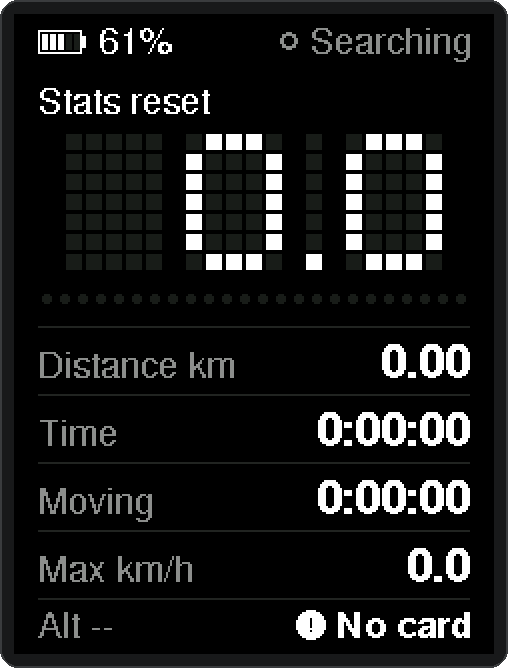<br><sub><b>Stats reset</b><br>no card: counters cleared in memory</sub></td>
<td align="center" valign="top">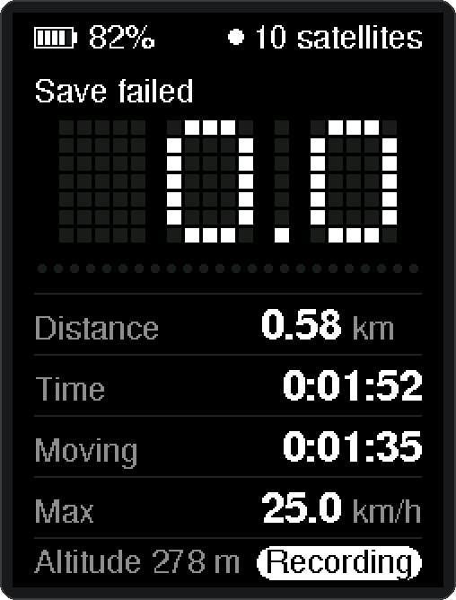<br><sub><b>Save failed</b><br>card error: the ride and its counters are kept</sub></td>
</tr>
</table>

## Download a ride to your phone

1. Power on OBJECT and keep it near your phone.
2. Open the [OBJECT HUB](https://object.nav-tech.workers.dev).
3. Tap **Connect**, choose the **OBJECT** device (name from `ble_name`, default `OBJECT-001`).
4. On OBJECT, press the button within **10 seconds** when it shows **Press to allow**. If you miss the window, the link drops and no files are listed — connect again.
5. Tap a ride to download its GPX file. Rides are listed by date under month headings. After a download, the hub remembers the ride's distance, elapsed time and climb and shows them in the list.
6. Delete archived rides with the trash control when you want to free card space. `CURRENT.GPX` cannot be deleted while it is the live recording.

<table>
<tr>
<td align="center" valign="top">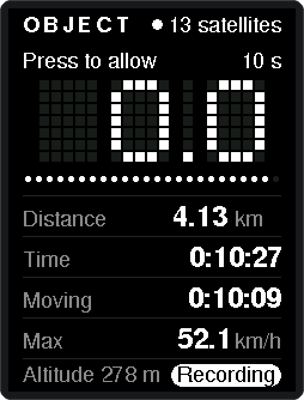<br><sub><b>Press to allow</b><br>10 seconds to confirm; arrows point to the button</sub></td>
<td align="center" valign="top">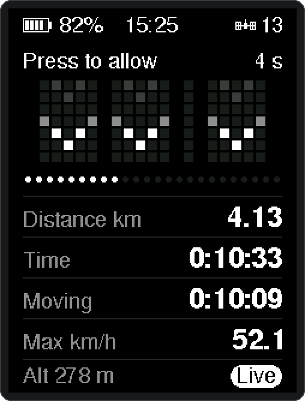<br><sub><b>Window closing</b><br>the gauge drains with it</sub></td>
<td align="center" valign="top">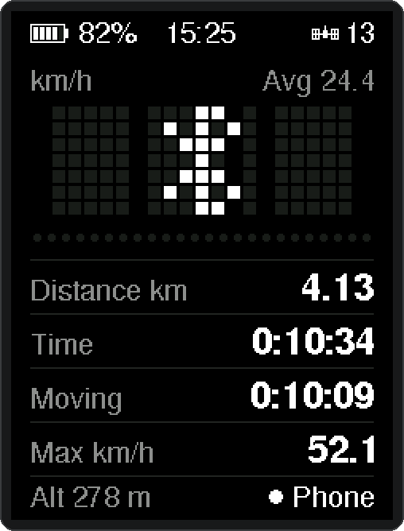<br><sub><b>Allowed</b><br>Bluetooth mark, footer shows Phone</sub></td>
<td align="center" valign="top">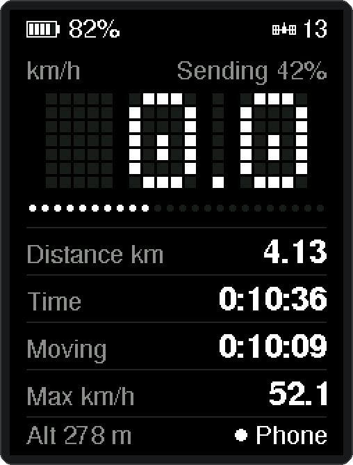<br><sub><b>Sending 42%</b><br>caption and gauge track the transfer</sub></td>
</tr>
</table>

You can also download `CURRENT.GPX` without finishing the ride. The device sends a snapshot ending at the point where the transfer began.

In Chrome on Android, tap **Add OBJECT HUB to the home screen** at the bottom of the page, or **Install app** in Chrome's menu. The hub then opens like an app and loads without a network connection, so you can download rides at the trailhead.

For the documented browser setup, use **Chrome on Android**, or [Bluefy on iPhone](https://apps.apple.com/app/bluefy-web-ble-browser/id1492822185), since Safari does not expose Web Bluetooth. To host your own copy, serve [docs/index.html](docs/index.html) over **HTTPS**.

If a transfer stalls, disconnect and reconnect before trying again.

## Change settings from your phone

After connecting and allowing the link, switch the hub from **Rides** to **Settings** (or open the hub with `#settings` at the end of its address). It reads the settings from the card and shows them as:

- **Display:** units (metric or imperial), backlight at power-on, dim brightness, and [animations](#animations) on or off.
- **Bike:** wheel size, picked from common tyre sizes (700C, 650B/27.5″, 29″, 26″, 20″) or entered as a measured circumference in mm.
- **Ride:** how long the wheel must stand still before moving time auto-pauses.
- **Device:** the Bluetooth name, and the time zone used to name saved rides (one tap copies the phone's).
- **Advanced:** the speed above which wheel readings are ignored as noise.

Change what you need and tap **Save**. OBJECT checks every value, rewrites `CONFIG.TXT` on the card and applies it straight away, with no reboot. A new wheel size counts only from that moment, so the distance already ridden stays correct. A new name is used from the next connection. Saving needs a card in the device.

<p align="center">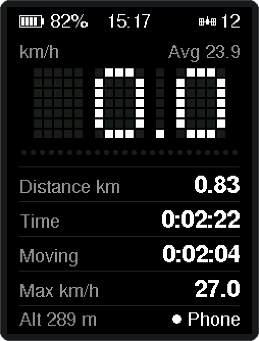<br><sub><b>Settings saved</b><br>switched to imperial from the hub mid-ride</sub></p>

## Ride files

| File           | Contents                                                                            |
| -------------- | ----------------------------------------------------------------------------------- |
| `CONFIG.TXT`   | Ride settings (wheel size, timezone offset, backlight, BLE name, …), editable from the hub or by hand |
| `CURRENT.GPX`  | Current GPS track                                                                   |
| `TRIP.DAT`     | CRC-checked checkpoint of wheel counters, timings, maximum speed and track position |
| `YYMMDDHH.GPX` | First-choice archive name, based on GPS time plus `timezone_offset_min` when saving |
| `YYMMDDnn.GPX` | Collision fallback; the final pair is a sequence, not necessarily an hour           |
| `RIDEnnnn.GPX` | Numbered fallback when a date-based name is unavailable                             |

Points are attempted no more frequently than once per second, after the trip starts, when GPS data passes the current checks. Subsequent points also require advancing GPS time and a coordinate change of at least `0.000018°` on either latitude or longitude. That is about 2 m in latitude; it is not a fixed travel-distance threshold.

GPX exports contain coordinates, timestamps and altitude when available - to make a smooth import to Strava app. **They do not preserve the wheel-derived ride summary**, so another app's calculated distance and moving time may slightly differ from the device's readings.

## Hardware

| Part                                    | Job                                                                      |
| --------------------------------------- | ------------------------------------------------------------------------ |
| Seeed XIAO nRF52840 Sense               | Microcontroller, Bluetooth and USB                                       |
| 3.2″ ILI9341 IPS SPI display, 240 × 320 | Ride display and onboard microSD slot; LCDWiki MSP3222/MSP3223 interface |
| microSD card                            | Store GPS tracks and trip checkpoints                                    |
| Reed switch and wheel magnet            | One pulse per wheel revolution                                           |
| HGLRC M100 Pro GPS                      | Position, altitude and UTC time                                          |
| Momentary pushbutton                    | Backlight control and new-ride action; shares D4 with battery sense      |
| 2 × 100 kΩ resistors                    | Battery divider into D4 (pin sees Vbat/2)                                |
| 100 nF capacitor                        | Holds the battery-sense voltage steady for the ADC                       |
| Adafruit bq25185 charger, **PID 6091**  | Battery charging and power-path management                               |
| 2000 mAh, single-cell LiPo              | Portable power                                                           |
| Schottky diode                          | Prevents XIAO USB power feeding back into the charger LOAD rail          |
| 7 kΩ resistor                           | Holds the display reset input high                                       |

## Wiring

Module-level assembly schematic showing the external connections.

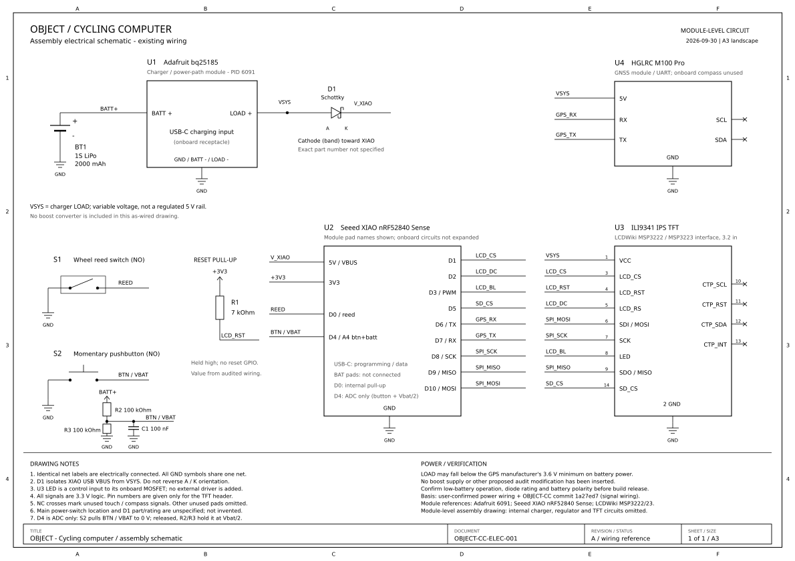

[Open the SVG schematic](docs/schematic.svg) to zoom in or print it.

### Power

**`VSYS` means the bq25185 LOAD rail.** Display and GPS power branch off before the Schottky diode.

| From                                 | To                                                      |
| ------------------------------------ | ------------------------------------------------------- |
| LiPo positive / negative             | Charger **BATT+ / BATT−**, observing connector polarity |
| Charger **LOAD+ / VSYS**             | Schottky **anode**                                      |
| Schottky **cathode**, the banded end | XIAO **5V / VBUS** pin                                  |
| Charger **LOAD+ / VSYS**             | Display **VCC**                                         |
| Charger **LOAD+ / VSYS**             | GPS **5V** input                                        |
| Charger **LOAD− / GND**              | XIAO, display, GPS, reed switch and button grounds      |
| Charger **BATT+** (LiPo positive)    | 100 kΩ to XIAO **D4** (battery sense)                   |

The battery divider draws about 20 µA (Vbat / 200 kΩ) all the time, including while the device is off.

The battery connects to the external charger; the XIAO's battery pads are unused. Charge through the **bq25185 USB-C port**. The XIAO's USB-C port is used for programming and serial diagnostics; it does not charge the external battery through this isolated LOAD connection.

The charger defaults to **1 A charging**. Check the particular battery's permitted charging current and polarity before connecting it. The XIAO's low-battery behavior also needs testing with the fitted diode's voltage drop; the on-screen battery percentage helps with that.

References: [Adafruit #6091](https://www.adafruit.com/product/6091), [HGLRC M100 Pro](https://www.hglrc.com/products/hglrc-m100-pro-gps), [LCDWiki display documentation](https://www.lcdwiki.com/3.2inch_IPS_SPI_Module_ILI9341).

### Display and microSD

| Display pin  | Connection                         |
| ------------ | ---------------------------------- |
| VCC          | Charger **LOAD+ / VSYS**           |
| GND          | Common GND                         |
| LCD_CS       | XIAO **D1**                        |
| LCD_RS / D-C | XIAO **D2**                        |
| LCD_RST      | **7 kΩ resistor to XIAO 3V3**      |
| SDI / MOSI   | XIAO **D10**                       |
| SCK          | XIAO **D8**                        |
| SDO / MISO   | XIAO **D9**                        |
| LED          | XIAO **D3**, PWM backlight control |
| SD_CS        | XIAO **D5**                        |

The display and microSD share the SPI bus, with separate chip-select pins. D3 controls brightness rather than supplying the backlight current. Touch pins are unused.

### GPS

`Serial1`, **115200 baud, 8N1**. Firmware attempts to configure 1 Hz position updates.

| GPS pin | Connection               |
| ------- | ------------------------ |
| 5V      | Charger **LOAD+ / VSYS** |
| GND     | Common GND               |
| TX      | XIAO **D7 / RX**         |
| RX      | XIAO **D6 / TX**         |

GPS compass pins are unused.

### Wheel sensor, button and battery sense

- **Reed switch:** between **D0** and **GND**. One falling edge counts one wheel revolution. Uses the XIAO's internal pull-up.
- **Button:** normally open, between **D4** and **GND**. D4 has no pull-up; the firmware reads it only with the ADC, and below about 0.35 V counts as pressed.
- **Battery sense (same pin):** LiPo **BATT+** → 100 kΩ → **D4** → 100 kΩ → **GND**, plus 100 nF from **D4** to **GND**.

With the button released, the divider holds D4 at Vbat/2 (about 1.5–2.1 V). That is not a valid digital level, which is why D4 is read as analog only. Pressing the button pulls D4 to 0 V.

## Set it up for your bike

Ride settings live in **`CONFIG.TXT`** on the microSD card root. On first boot with a card that has no config file, firmware writes a default `CONFIG.TXT` (same content as [docs/CONFIG.TXT.example](docs/CONFIG.TXT.example)). The easiest way to change them is [from your phone](#change-settings-from-your-phone). You can also edit the file on any computer, reinsert the card, and reboot — no reflash needed. Saving from the hub rewrites the whole file, so comments you added by hand are lost.

| Key | Default | Notes |
| --- | --- | --- |
| `wheel_circ_mm` | `2155` | Measured rollout in mm (700 × 32C starting value). Range 1000–3000. |
| `timezone_offset_min` | `0` | Minutes from UTC for archive filenames only. GPX timestamps stay UTC. |
| `backlight` | `bright` | Boot level: `bright`, `dim`, or `off`. |
| `ble_name` | `OBJECT-001` | BLE advertise name, 1–20 printable characters, no spaces. |
| `units` | `metric` | `metric` or `imperial` (display only; trip storage stays metric). |
| `backlight_dim` | `40` | PWM duty for dim mode, 1–254. |
| `max_speed_kmh` | `100` | Faster reed intervals are treated as noise. Range 20–200. |
| `stopped_ms` | `3000` | No pulse for this long ⇒ stopped (moving time). Range 1000–10000. |
| `animations` | `on` | `on` or `off`: the [matrix animations](#animations). |

For distance accuracy, measure wheel rollout rather than assuming every tire with the same size marking has the same circumference. Changing the wheel size from the hub keeps the distance already ridden. **When editing `wheel_circ_mm` on a computer, finish the current ride first**, or a resumed `TRIP.DAT` will recount the whole ride with the new circumference.

Invalid or unknown keys are ignored; missing keys keep the defaults above.

<table>
<tr>
<td align="center" valign="top">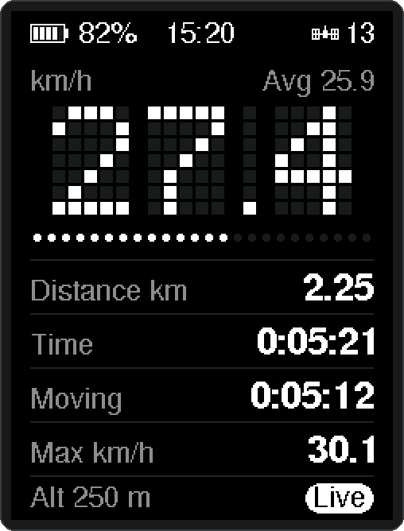<br><sub><code>units=metric</code></sub></td>
<td align="center" valign="top">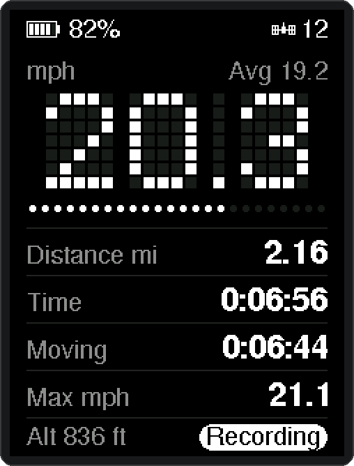<br><sub><code>units=imperial</code></sub></td>
</tr>
</table>

`units` changes speed, distance and altitude on screen. The gauge stays at 2 km/h per dot either way.

## Firmware

Main sketch: [xiao_oled/xiao_oled.ino](xiao_oled/xiao_oled.ino).

### Libraries

Install through Arduino Library Manager:

- Adafruit ILI9341
- Adafruit GFX Library
- Adafruit BusIO

Use the **Seeeduino nRF52** board core. This project's setup uses its bundled SdFat and Bluefruit libraries; do not install SdFat 2.3.x separately.

### Build and upload

Board identifier: `Seeeduino:nrf52:xiaonRF52840Sense`.

```bash
arduino-cli board list
arduino-cli compile --fqbn Seeeduino:nrf52:xiaonRF52840Sense xiao_oled
arduino-cli upload -p <PORT> --fqbn Seeeduino:nrf52:xiaonRF52840Sense xiao_oled
```

Replace `<PORT>` with your board's port and upload only after compilation succeeds. Serial diagnostics use **115200 baud**.

## Repository layout

```text
xiao_oled/     Cycling computer firmware
docs/          Ride-transfer page, assembly schematic, CONFIG.TXT.example, README screens
tools/screens/ Emulator that regenerates the README screens from the firmware
AGENTS.md      Notes for automated agents
```

## License

[PolyForm Noncommercial License 1.0.0](LICENSE). Personal, hobby and other qualifying noncommercial use is covered by the license. Commercial use requires a separate license from the copyright holder.